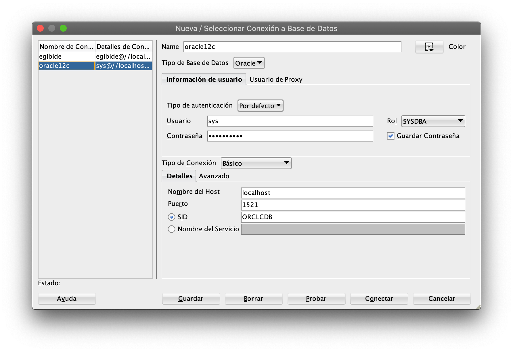
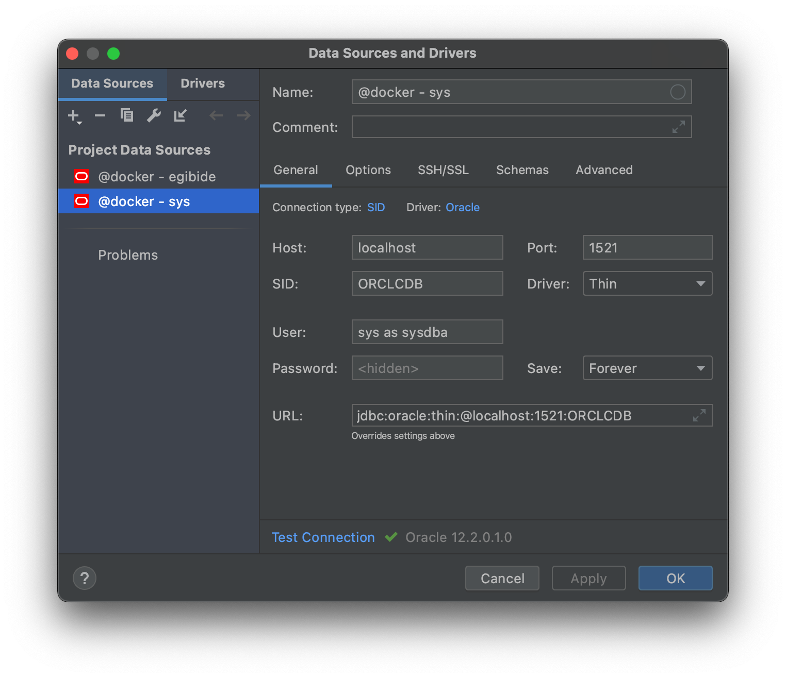

# Oracle 12c con Docker

Instrucciones y fichero de configuración para arrancar una base de datos Oracle 12c en local mediante Docker.

> ⚠️ Estas instrucciones solo sirven para Macs con procesador Intel; no funcionan en los M1 porque no hay versión
> de Oracle Database para arquitectura ARM64.

## Prerrequisitos

1. Instalar Docker Desktop para [Windows y macOS](https://www.docker.com/products/docker-desktop)
   o [Linux](https://docs.docker.com/desktop/linux/).

2. Instalar [Oracle SQL Developer](https://www.oracle.com/es/database/technologies/appdev/sql-developer.html) (requiere
   iniciar sesión con una cuenta de Oracle o crear una nueva si todavía no se dispone de una)
   o [JetBrains DataGrip](https://www.jetbrains.com/es-es/datagrip/) (requiere una suscripción).

3. En Windows, instalar [Scoop](https://scoop.sh) usando PowerShell:

   ```powershell
   Set-ExecutionPolicy RemoteSigned -Scope CurrentUser
   [Net.ServicePointManager]::SecurityProtocol = [Net.SecurityProtocolType]::Tls12
   Invoke-Expression (New-Object System.Net.WebClient).DownloadString('https://get.scoop.sh')
   ```

   Y después instalar los comandos necesarios:

   ```powershell
   scoop install git make
   ```

4. Clonar este repositorio:

   ```shell
   git clone https://github.com/ijaureguialzo/oracle12c.git
   ```

## "Comprar" la imagen de Oracle Database en Oracle Container Registry

1. Buscar la imagen oficial
   de [Oracle Database Enterprise Edition](https://container-registry.oracle.com/ords/f?p=113:4:6346328126496:::4:P4_REPOSITORY,AI_REPOSITORY,AI_REPOSITORY_NAME,P4_REPOSITORY_NAME,P4_EULA_ID,P4_BUSINESS_AREA_ID:9,9,Oracle%20Database%20Enterprise%20Edition,Oracle%20Database%20Enterprise%20Edition,6,0&cs=3d7S7J47epiaT8Vq1utloicweB2qendPAlshTo3MK16NtIKtyZzj28QPB2jsuUNu0aPrc7P3SBtSh-poXV78pjg)
   .
2. Iniciar sesión con la cuenta de Oracle, aceptar el acuerdo de licencia y _comprar_ la imagen (es _gratis_, a cambio
   de los datos personales, para
   desarrolladores).

> Siguiendo estos pasos, la imagen queda asociada a nuestra cuenta de Docker Hub, no hay que hacer nada más.

## Iniciar sesión en Oracle Container Registry

Abrir un terminal y lanzar el comando:

   ```shell
   docker login container-registry.oracle.com
   ```

Pedirá el usuario y contraseña de la cuenta de Oracle.

## Arrancar la base de datos

1. En un terminal, situarse en la carpeta que contiene el fichero `docker-compose.yml`.
2. Arrancar el servidor:

   ```shell
   make start
   ```

3. Cuando haya arrancado (tarda unos minutos) aparecerá `(healthy)` en la salida del comando `docker ps`.

   > Para parar el servidor hay que utilizar el comando `make stop`.

## Datos de conexión

| Clave            | Valor                                                                                                    |
|------------------|----------------------------------------------------------------------------------------------------------|
| Usuario          | `sys`                                                                                                    |
| Contraseña       | Se genera automáticamente en el primer arranque y se muestra en el log. Para verla, ejecutar `make logs` |
| Tipo de conexión | Básico                                                                                                   |
| Rol              | `SYSDBA`                                                                                                 |
| Host             | `localhost`                                                                                              |
| Puerto           | `1521`                                                                                                   |
| SID              | `ORCLCDB`                                                                                                |

## Script para crear usuario

Para crear un usuario _normal_ con el que trabajar, el fichero [crear_usuario.sql](crear_usuario.sql) contiene un script
que se puede adaptar y ejecutar estando conectado como `sys` al servidor.

## Conexión al servidor de base de datos

### Desde SQL Developer



### Desde DataGrip


